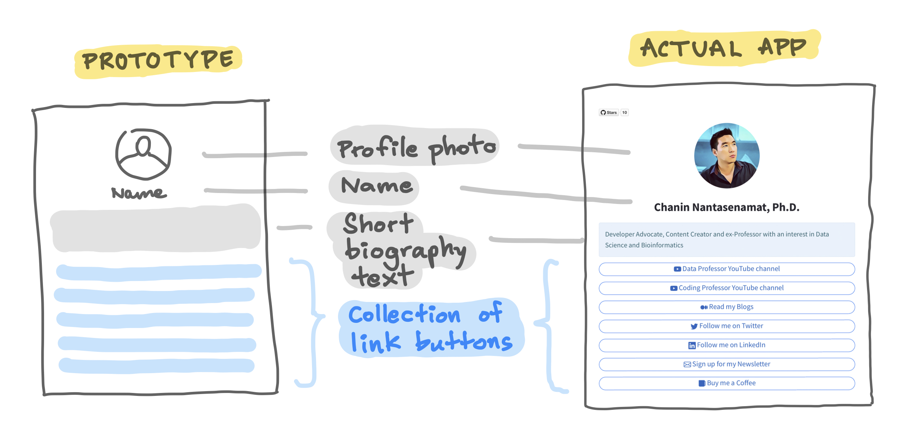
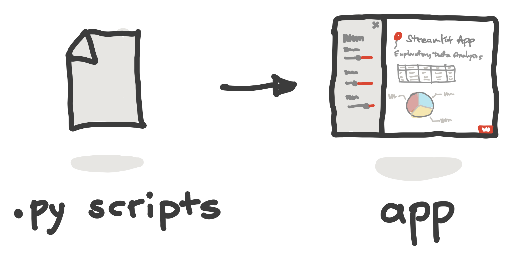
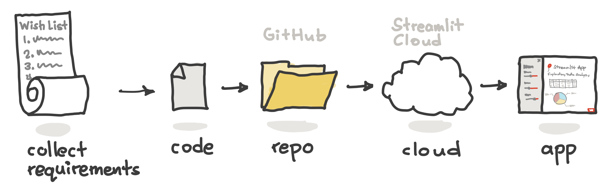
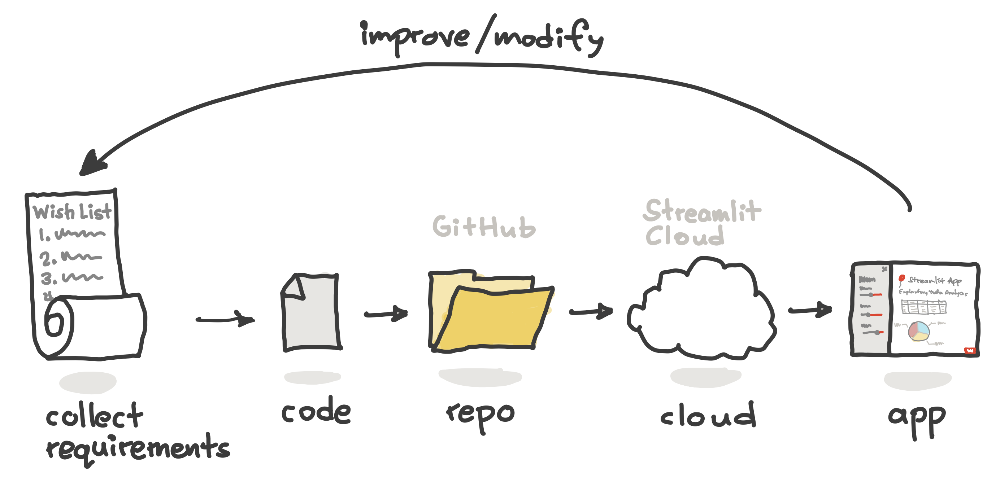
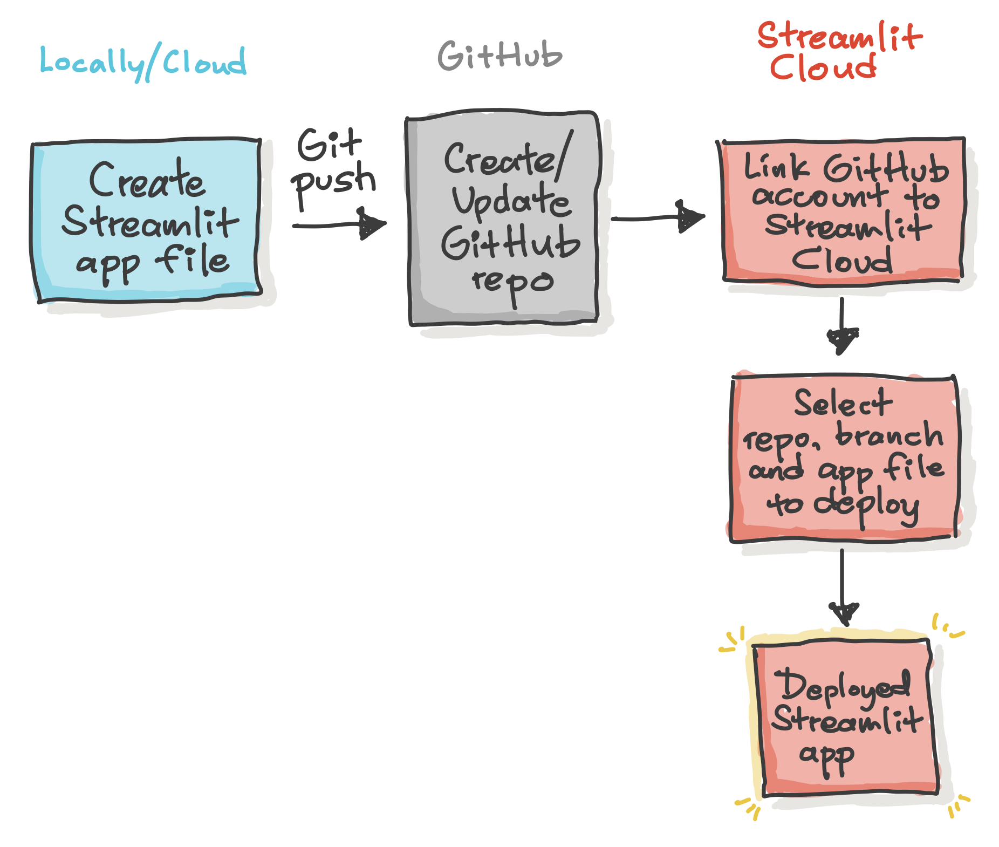
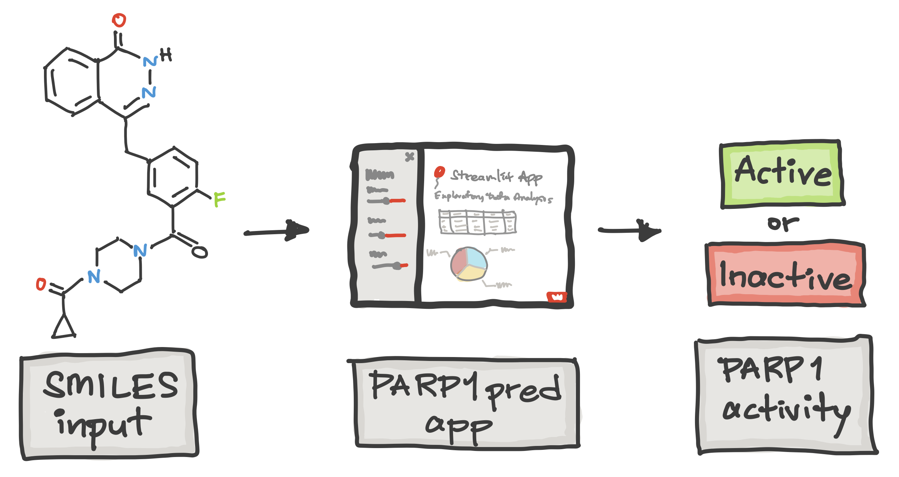

# streamlit-cartoon
> A collection of hand-drawn illustrations about Streamlit.

Title | Preview | Source
---|---|---
`Diagram` - App prototype |  | [Read blog](https://blog.streamlit.io/hackathon-101-5-simple-tips-for-beginners/) ∙ [Demo app](https://chanin.streamlit.app/)
`Workflow` - Code to app |  | -
`Workflow` - Idea to app (v.1) |  | -
`Workflow` - Idea to app (v.2) |  | -
`Workflow` - Community cloud |  | [Read blog](https://blog.streamlit.io/host-your-streamlit-app-for-free/)
`Use case` - Cheminformatics |  | [Read paper](https://pubmed.ncbi.nlm.nih.gov/36814851/) ∙ [Demo app](https://parp1pred.streamlit.app/)
